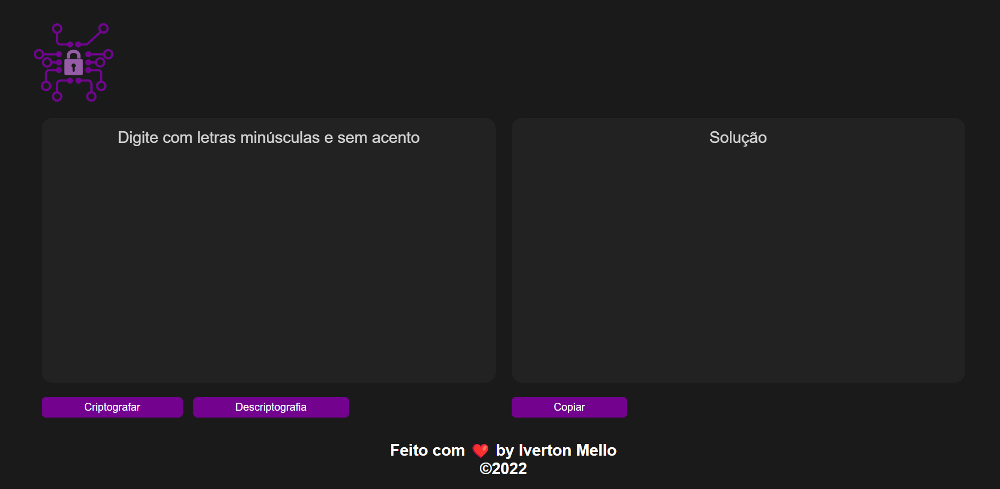

<h1 align="center"> Decodificador de Texto </h1>

Desenvolvido como resolução ao desafio do programa ONE | Alura, Edição #3: Challenge ONE Iniciante em Programação.  

  <a href="#-tecnologias">Tecnologias</a>&nbsp;&nbsp;&nbsp;|&nbsp;&nbsp;&nbsp;
  <a href="#-projeto">Projeto</a>&nbsp;&nbsp;&nbsp;|&nbsp;&nbsp;&nbsp;
  <a href="#-layout">Layout</a>&nbsp;&nbsp;&nbsp;|&nbsp;&nbsp;&nbsp;
  <a href="#memo-licença">Licença</a>

  

 

  

## 🚀 Tecnologias

Esse projeto foi desenvolvido com as seguintes tecnologias:

- HTML e CSS
- JavaScript
- Git e Github

## 💻 Projeto

O Desafio se baseou no Challenge Based Learning, ou seja, a aprendizagem baseada em desafios que a Apple ajudou a criar, definida em 3 pilares:

- ENGAJAR (TRELLO E DISCORD)

- INVESTIGAR (CURSOS E FORMAÇÕES)

- AGIR (CODIFICAR GITHUB E PUBLICAR LINKEDIN)

- [Acesse o projeto finalizado, AQUI](https://ivertoncrow.github.io/Decodificador-de-Texto/)

## :memo: Licença

Esse projeto está sob a licença MIT.

---

Feito com ♥ by Iverton Mello and ONE | Alura.